# ExamQuery

ExamQuery is an AI-driven competitive exam preparation app (MVP) built using Flutter, Dart, Firebase, OpenAI API, and GetX state management.

## Code Availability

Important Note: This project is part of my internship at Cehpoint and the source code is proprietary. As per the organization's policies, the code is not available for public sharing.  However, this README provides an overview of the project's features, along with a demo video and screenshots.

## Demo Video

https://github.com/user-attachments/assets/bbe12810-5f31-4277-9cba-da0baacb567b

## Screenshots

 

    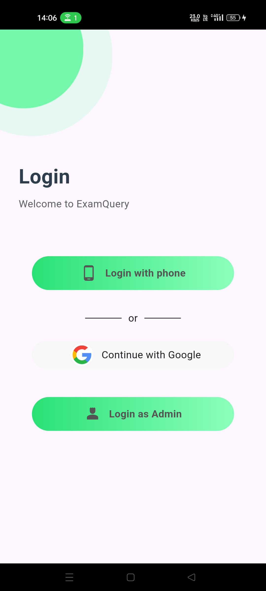
    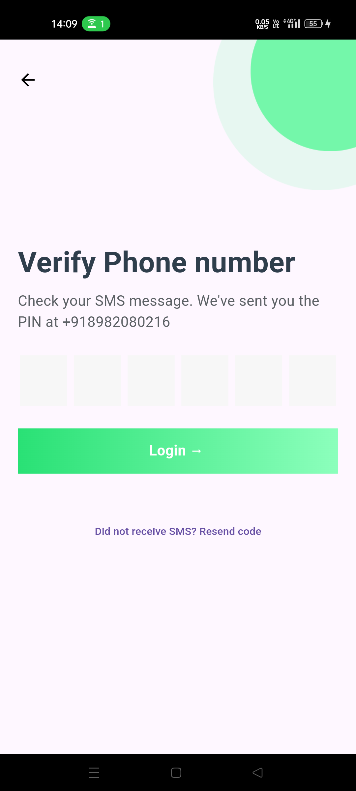
    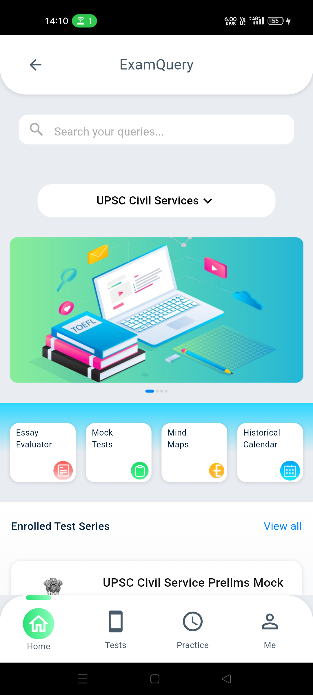
    

    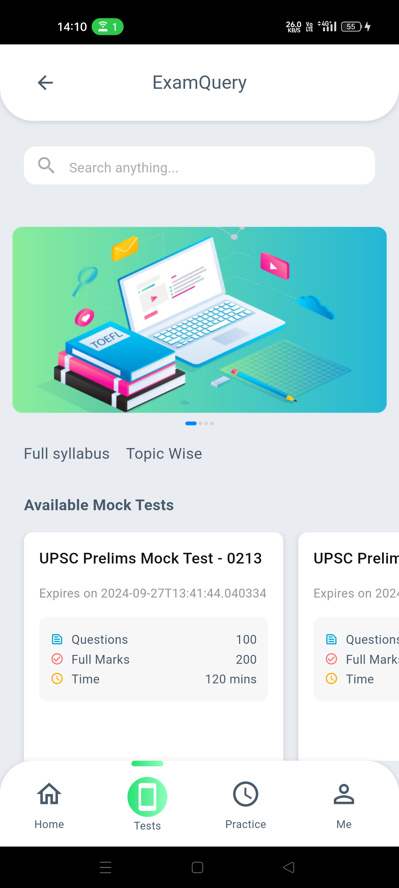
    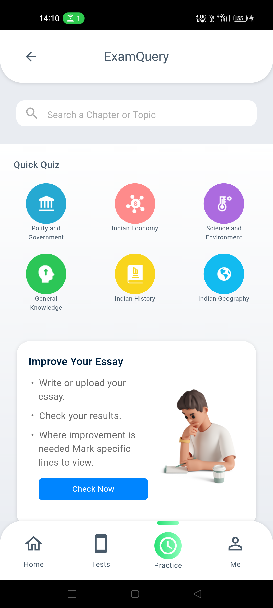
    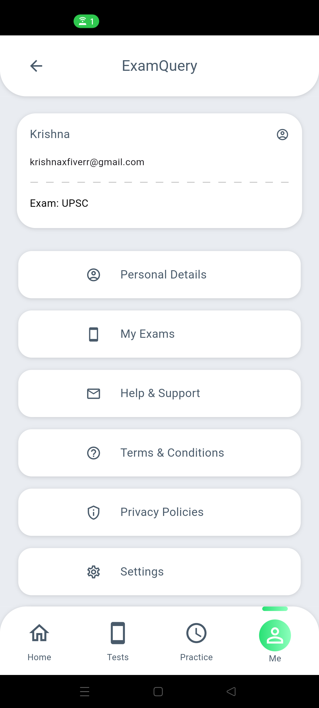
    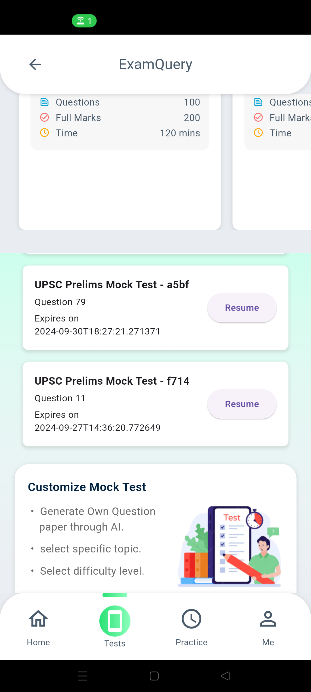

    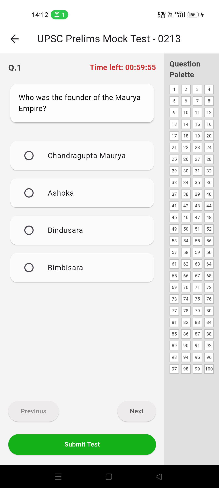
    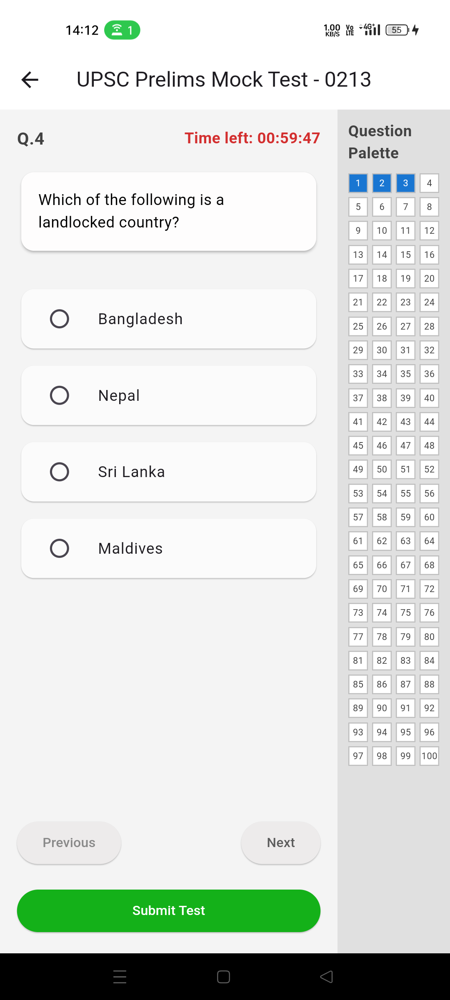
    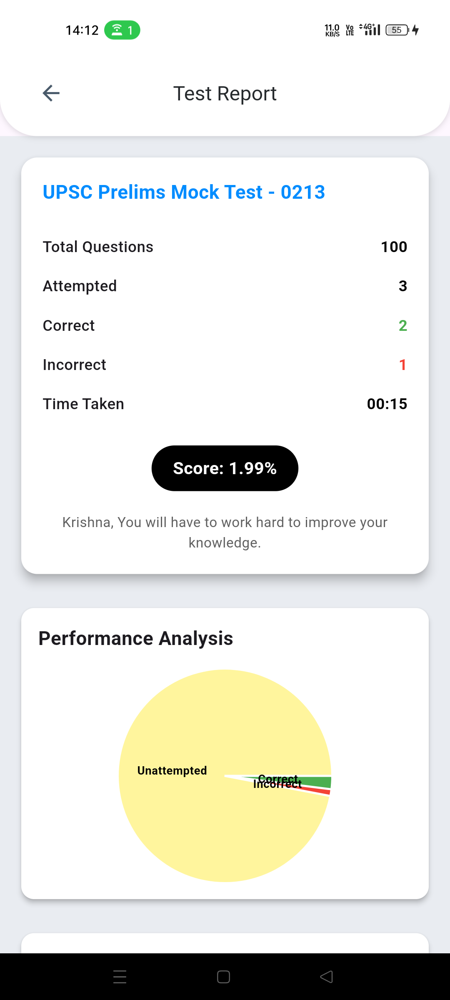
    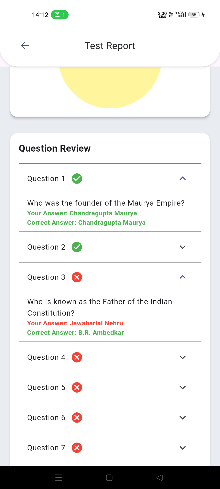

    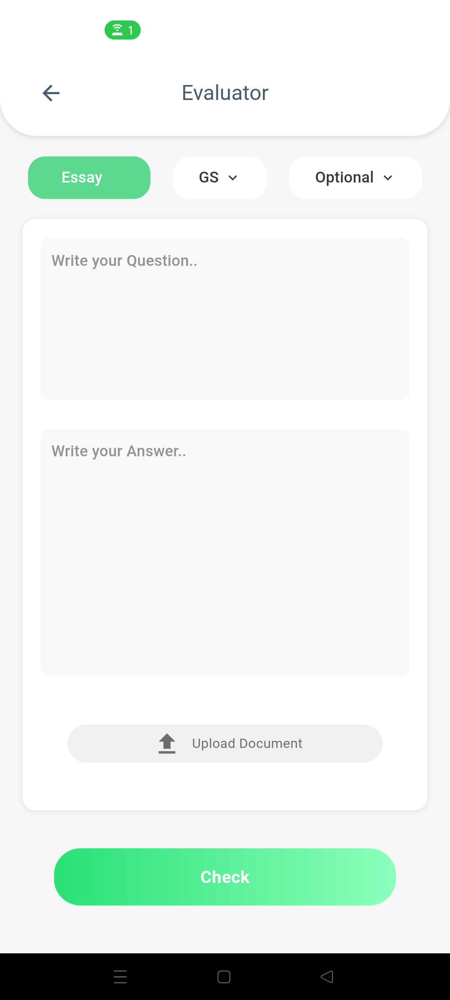
    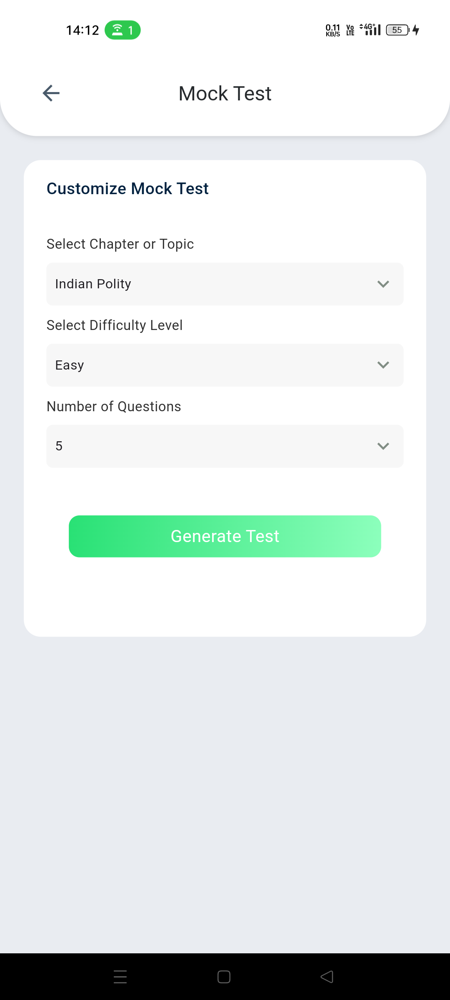
    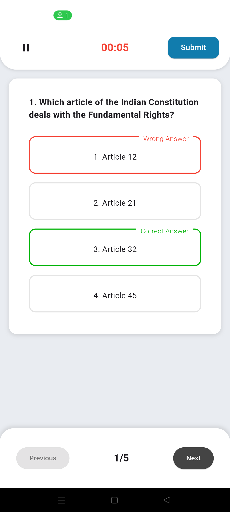
    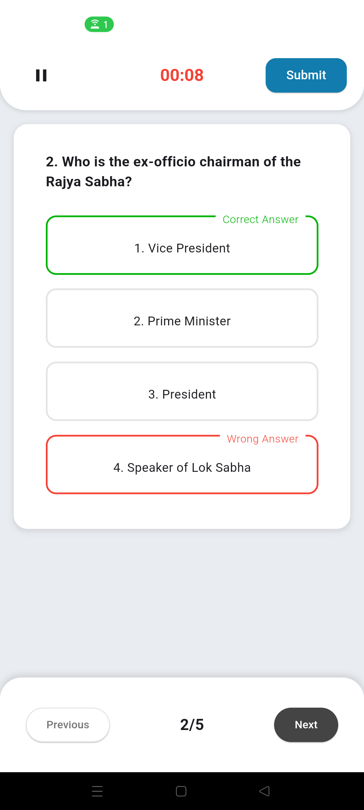

    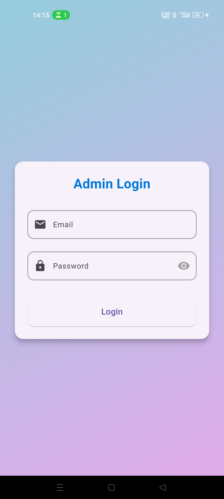
    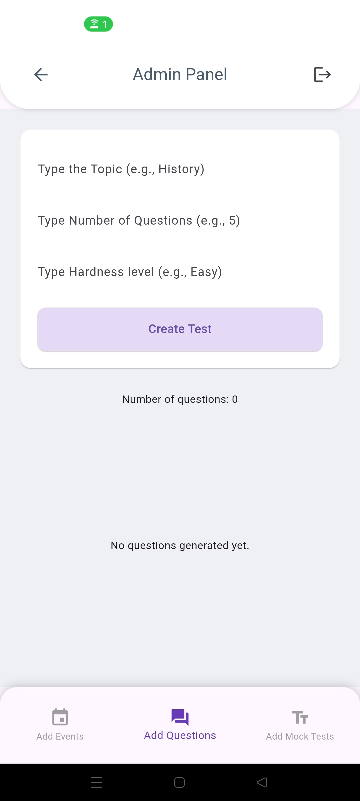
    
    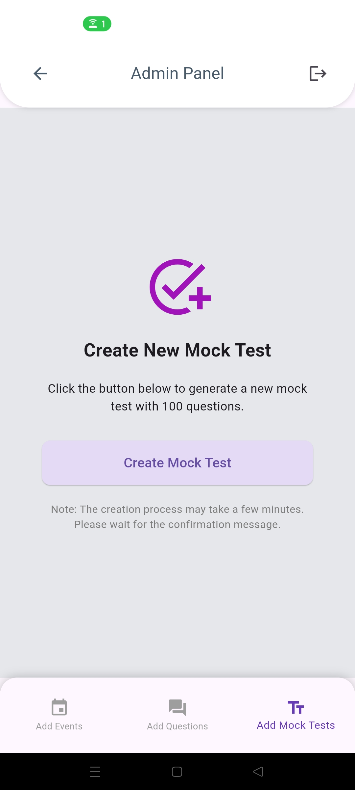

## Features

### Authentication

- Secure log in using phone number and OTP verification
- Google Sign-In option for easy access
- Admin login feature for managing content and users

### Mock Tests

- Take dynamic mock tests for various exams, including the UPSC Civil Services Prelims
- Each mock test includes 100 questions, 200 marks, and a 120-minute time limit
- Tests are generated dynamically, ensuring a unique experience every time
- Pause and resume tests according to convenience settings
- Get detailed report of the results

### Personalized Study Plans

- Create and manage personalized study plans based on your exam goals
- Track progress and adjust study plans as needed

### Performance Tracking

- Detailed analytics on test performance, including scores, time taken, and areas of improvement
- View past performance to track improvement over time

### Calendar and Events

- Integrated calendar to keep track of important exam dates and study sessions
- Add and manage events related to exams and study plans

### Notifications

- Stay updated with real-time notifications about upcoming exams, deadlines, and more
- Personalized notifications based on your study plan and exam schedule

### Study Resources

- Access a wide range of study materials, including essays, quizzes, and mind maps
- Regularly updated content to help you stay ahead

### Essay Evaluation

- Submit essays for evaluation
- File uploads for evaluation
- Receive detailed feedback and results

### Mind Maps

- Visual learning aids to help understand complex topics
- Browse and interact with various mind maps

### Admin Features

- Add and manage questions for mock tests
- Create custom mock tests
- Manage user data and application settings

## License

This project is the property of Cehpoint and is subject to their terms and conditions.

### Thank you!